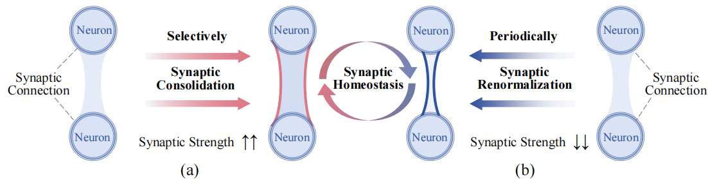
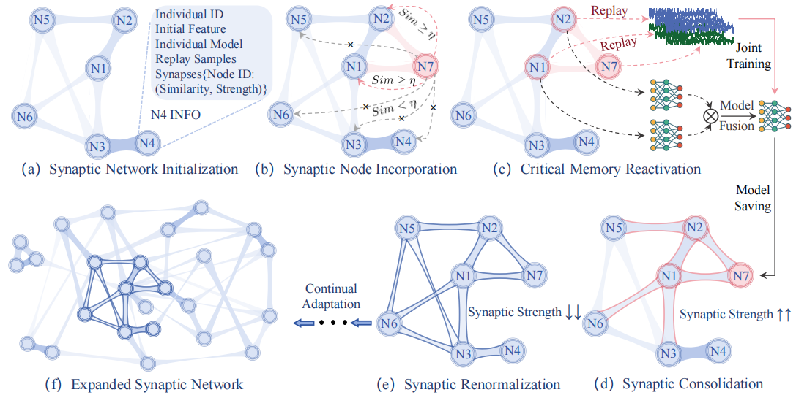

<div align="center">
  
# SPICED

_A Synaptic Homeostasis-Inspired Framework for Unsupervised Continual EEG Decoding_
</div>
🔥 NEWS: This paper has been accepted by NeurIPS 2025

## 🔍 About
We propose **SPICED**, a novel framework that abstracts and simplifies complex biological neural mechanisms into a computationally feasible continual learning approach, and apply it to continuous brain decoding tasks. ([Arxiv](https://arxiv.org/pdf/2509.17439))
<div align="left">

</div>

## 🚢 Process
SPICED comprises a novel synaptic network that enables dynamic expansion during continual adaptation through three bio-inspired neural mechanisms: (1) critical memory reactivation, which mimics brain functional specificity, selectively activates task-relevant memories to facilitate adaptation; (2) synaptic consolidation, which strengthens these reactivated critical memory traces and enhances their replay prioritizations for further adaptations and (3) synaptic renormalization, which are periodically triggered to weaken global memory traces to preserve learning capacities. The overview of SPICED as follows:
<div align="center">

</div>

## 🚀 Start
Step1: Pretrain the source model (Here, any EEG decoding model can be chosen):
```python
parser.add_argument('--is_pretrain', type=bool, default=True, help='pretraining')
```

Step2: To facilitate computing, we compute the initial features for all individuals (utils/calculate_propotype.py). Regarding the selection of initial features, different feature extraction schemes can be designed according to specific tasks. We only provide a preliminary extraction approach.

Step3: Initialize the synaptic network and begain continual decoding


